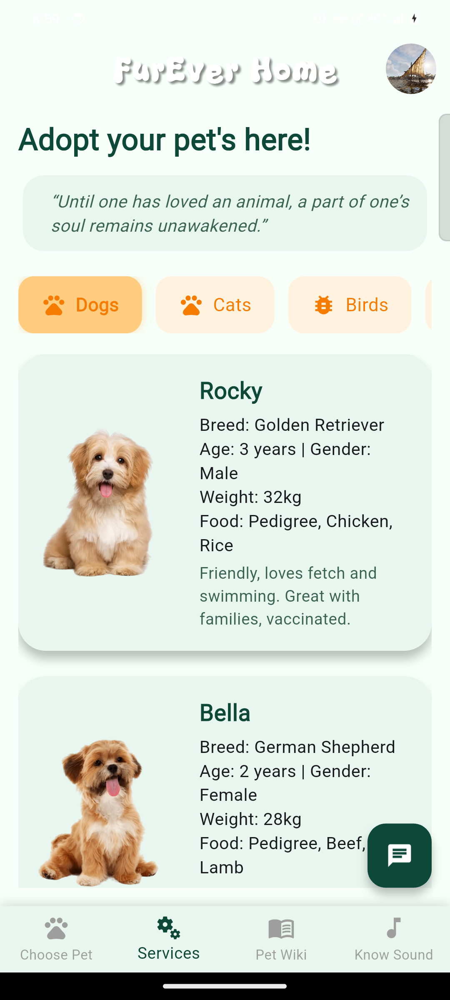
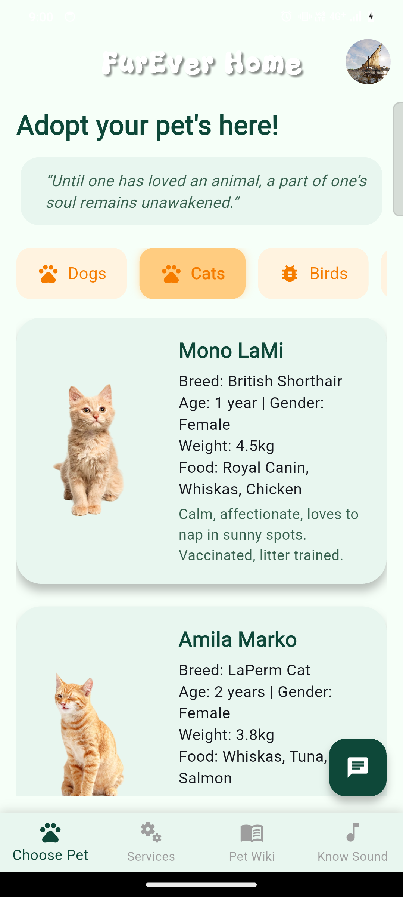
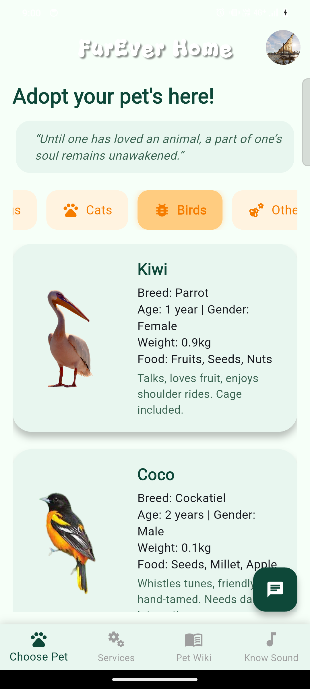
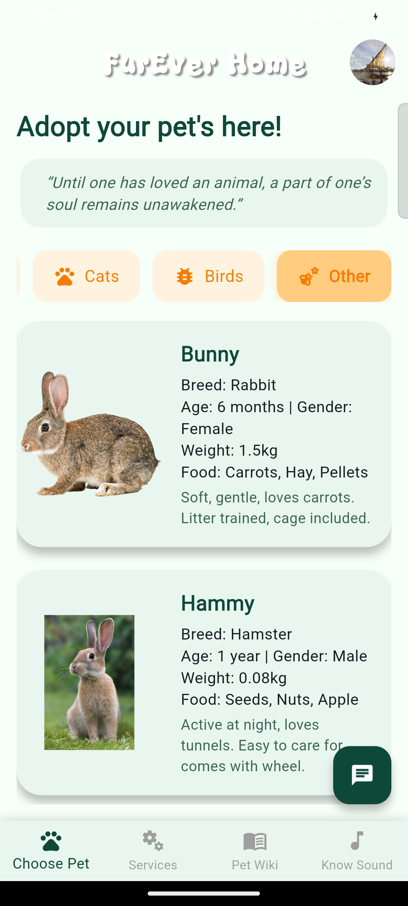
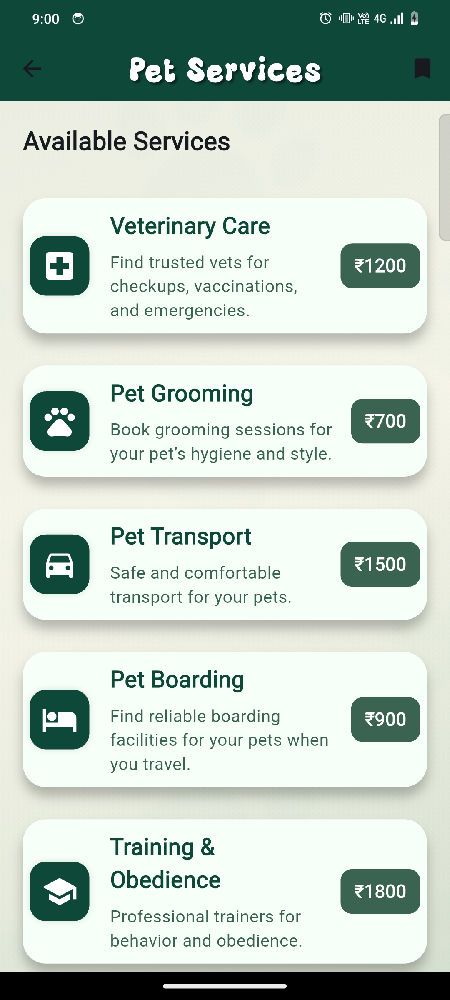

# 🐾 FurEver Home  

### 🌐 [Live on Vercel →](https://fur-ever-home-git-webbuild-bharath-balas-projects.vercel.app/)

A Flutter application dedicated to **pet lovers**, offering a community space to share stories, learn about animals, and support pet adoption and welfare.

---

## ✨ Features  

- **🐶 Community Feed:** Share pet stories, photos, and experiences with a vibrant community. See posts from other pet lovers in real-time — powered by Firebase.  
- **🔊 Know the Sound:** Learn and identify sounds of animals such as dogs, cats, and parrots with an interactive quiz.  
- **💖 Donate & Volunteer:** Discover ways to help animals — donate to shelters or volunteer your time.  
- **🤖 AI Support Chat:** Get quick pet-related answers from an integrated **Gemini-powered AI assistant**.  
- **🔥 Firebase Integration:** Secure authentication and real-time database for user content.  

---

## 📸 Screenshots  

|  |  |  |
|:--:|:--:|:--:|
|  |  |  |

> 📝 Make sure the image files (e.g., `flutter_01.png`, `flutter_02.png`, etc.) are located in your repository — either in the root folder or inside an `/assets` or `/screenshots` directory.  
> You can also use direct image links from GitHub or Vercel if you want them to render properly on your README.

---

## 🚀 Getting Started  

### **Prerequisites**  
- [Flutter SDK](https://flutter.dev/docs/get-started/install)  
- Code editor (VS Code or Android Studio)  
- Configured Firebase project  

---

### **Installation**

```bash
# Clone the repository
git clone https://github.com/rvsr26/FUREVERHOME-FLUTTER-.git

# Navigate to the project directory
cd FUREVERHOME-FLUTTER-

# Install dependencies
flutter pub get
